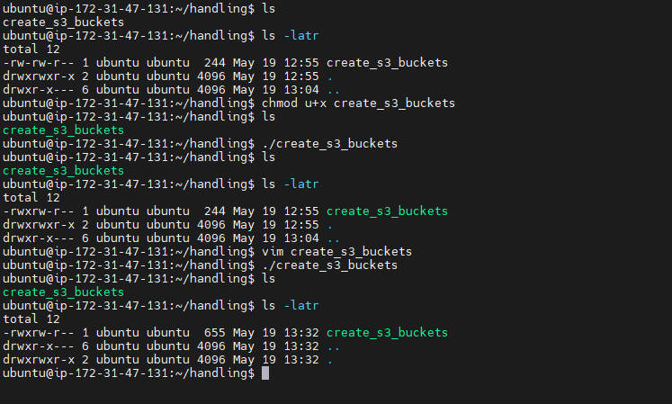
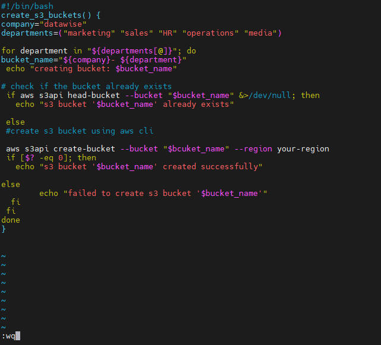
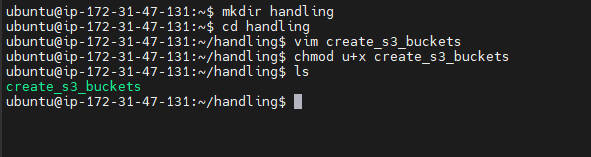

# error

## Error are crucial aspect of shell scripting, it may occur or arise from various factors such as incorrect input from the user, unexpected system behaviour or resource unavailability.
## Handling of error in shell scripting is essential and it improves the reliability and usability of shell script if its properly manage and resolved. 

### They are way to identify errors
-  potential error: to identify potential errors look into user input validation, command execution or the file operations.
- conditional statement: using a condition statement to check for errors.

